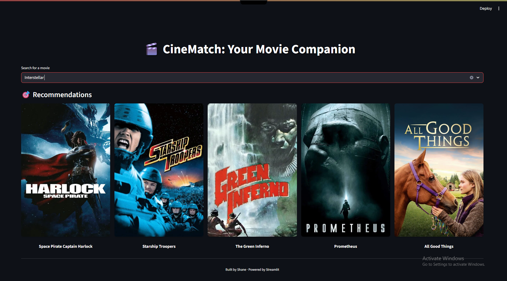

# movie-recommender
📽️ Movie Recommender System
A simple yet effective content-based movie recommender system using Streamlit and TMDB API. Search for any movie and get instant recommendations along with posters and clean UI.
# 🎬 CineMate — AI Movie Recommender


A minimal, beautiful Streamlit-based Movie Recommendation System that suggests 5 similar movies based on your input using NLP and TF-IDF.

🚀 Features
Recommend 5 similar movies based on description (TF-IDF + cosine similarity)

Fetch real movie posters using TMDB API

Clean, minimal UI with depth-styled headings

Dark-pink aesthetic theme

Fully responsive Streamlit app
---
🛠️ Technologies Used
Python

Pandas

Scikit-learn (TF-IDF + Cosine Similarity)

Streamlit

TMDB API

## ✨ Preview

### 🖼️ User Interface




> 🎨 Depth-styled white fonts, dark-blue theme, movie posters, autocomplete search

---

## 💡 Features

- 🔍 Search for any movie
- 📚 TF-IDF content-based recommendation
- 🎞️ Auto-fetch movie posters using TMDB API
- 🎨 Clean UI with smooth colors and text effects
- 📦 Easy setup and execution

---

## 🛠️ How to Run

```bash
▶️ How to Run Locally
Clone the repo:

git clone https://github.com/bsuryaprakash06/movie-recommender.git
cd movie-recommender

Install dependencies:
pip install -r requirements.txt

Run the app:
streamlit run app.py
```

## 📊 Language Usage


